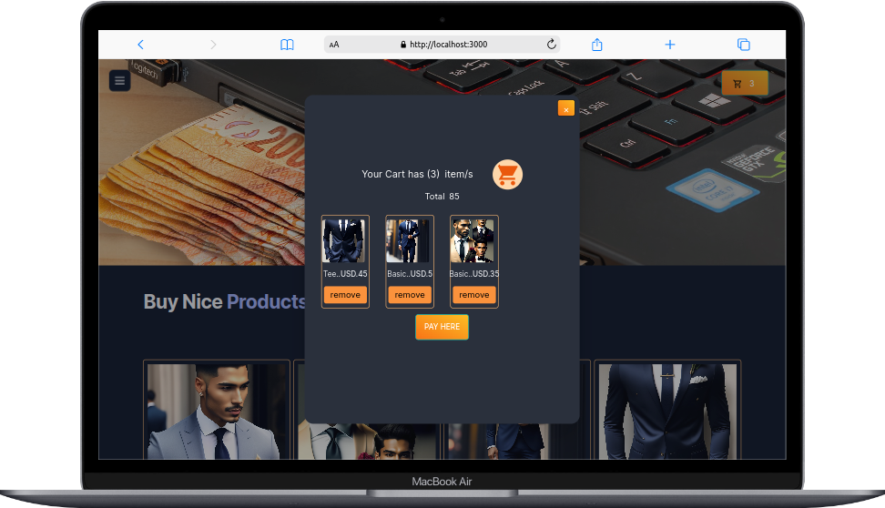
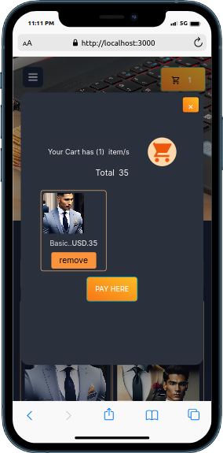

# Preview shop in Large Screen

# Preview shop in small Screen

# Nuxt 3 CRUD App

A Nuxt 3 app that displays how to use [ Auth Routes & Middleware](https://v3.nuxtjs.org/guide/directory-structure/server) to perform CRUD operations.

## Stuff used

- [Nuxt 3](https://v3.nuxtjs.org)
- [TailwindCSS](https://tailwindcss.com/)
- [paypal](https://developer.paypal.com/)

## How to start

1. Add supabase uri & supabase key to `.env` file
1. Install dependencies with `npm install --force` or `yarn`
1. Run dev with `npm run dev`
1. Build & deploy if you want to `npm run build`

## USAGE
0. This -[https://francis-shop.vercel.app/] is working in production
1. Use sandbox to test 
1. Live might or might not work depending on your credential accuracy in Paypal
1. replace CLIENT-ID with your client-id
